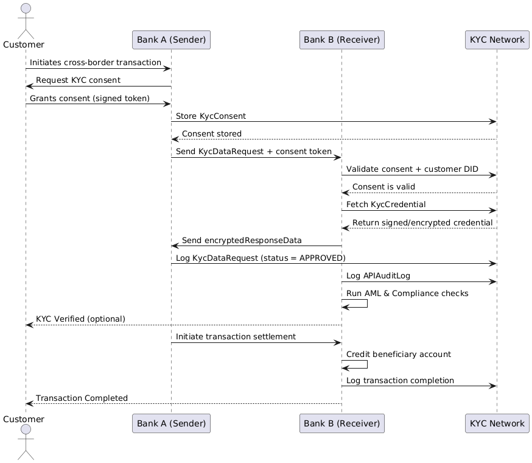

# Real-Time Cross-Border KYC Verification: Scalability & Business Impact

## Solution Overview
Our decentralized KYC verification network transforms cross-border payments by enabling banks to instantly share and verify customer identity information through secure digital credentials. This eliminates manual back-office processes that currently delay international transfers by days, replacing them with real-time cryptographic verification that takes seconds.

## Demo & Resources
- **Backend Services Repository**: [kyc-hub-services](https://github.com/manucr619/kyc-hub-services)
- **Frontend Portal Repository**: [kyc-hub-portal](https://github.com/manucr619/kyc-hub-portal)
- **Live UI Design Mock**: [View Demo](https://preview--kyc-hub-portal.lovable.app/)

## System Flow


The sequence diagram above illustrates the complete flow of a cross-border transaction with real-time KYC verification:
1. Customer initiates a cross-border transaction
2. Consent management and verification
3. Secure KYC data exchange between banks
4. Compliance checks and transaction settlement
5. Complete audit trail maintenance

## Scalability by Design

### Technical Scalability
- **Distributed Architecture**: Permissioned blockchain network distributes transaction load across participating nodes while maintaining privacy and security
- **API-First Approach**: Modern REST/gRPC APIs enable seamless integration with existing banking infrastructure and payment rails
- **Modular Implementation**: Banks can adopt incrementally, starting with high-volume corridors before full deployment
- **Throughput Capacity**: System designed to handle thousands of transactions per second with sub-second verification times
- **Horizontal Scaling**: Cloud-native design allows adding resources as network participation grows

### Operational Scalability
- **Standardized Credentials**: Common schema for KYC data enables interoperability across jurisdictions and institutions
- **Reduced Duplication**: Once verified, credentials are reusable across the network, eliminating redundant KYC processes
- **Automated Compliance**: Smart contracts enforce standards and regulatory requirements programmatically
- **Governance Framework**: Consortium structure with clear rulebook for adding new participants and evolving standards

## Business Impact

### Financial Institutions
- **Cost Reduction**: 60-80% decrease in KYC operational costs (currently $60M+ annually per institution)
- **Improved Customer Experience**: Cross-border payments complete in minutes instead of 3-5 days
- **Regulatory Compliance**: Immutable audit trails provide comprehensive evidence of verification
- **Risk Mitigation**: Reduced fraud exposure through cryptographically verified counterparty information
- **New Revenue Opportunities**: Enables faster expansion into new markets with streamlined onboarding

### Customers
- **Faster Transactions**: Immediate verification eliminates compliance delays in international transfers
- **Improved Privacy**: Selective disclosure and consent mechanisms give customers control over their data
- **Reduced Friction**: Single verification process creates a "digital KYC passport" recognized across borders
- **Enhanced Transparency**: Real-time visibility into transaction status and compliance requirements

### Market Impact
- **Network Effects**: Each additional participant enhances value for all members, creating strong adoption incentives
- **Integration with Future Systems**: Solution aligns with ISO 20022, SWIFT GPI evolution, and emerging CBDC initiatives
- **Global Standard Potential**: Framework could become foundation for cross-border identity verification beyond payments
- **Financial Inclusion**: Simplified KYC enables faster access to global financial system for underserved markets

## Implementation Roadmap
1. **Pilot Phase**: Implement between 5-10 major banks across 2-3 key corridors (US-EU, US-India)
2. **Expansion Phase**: Extend to regional banking networks and add additional corridors based on volume
3. **Standards Adoption**: Work with regulatory bodies to align with KYC compliance frameworks globally
4. **Network Growth**: Open platform to smaller institutions through simplified node hosting options
5. **Ecosystem Integration**: Connect with complementary services (sanctions screening, digital identity providers)

## Competitive Advantage
Our solution stands apart by prioritizing **compliance-by-design**, creating a system where KYC verification becomes a digital asset rather than a processing burden. Unlike siloed approaches, our network provides true interoperability while maintaining the highest security and privacy standards through modern cryptography and distributed architecture.

## Technical Stack
- **Backend**: Spring Boot with Java 17
- **Frontend**: Angular 17
- **Database**: PostgreSQL
- **API Documentation**: Swagger/OpenAPI
- **Security**: JWT, OAuth2
- **Monitoring**: Prometheus & Grafana
- **CI/CD**: GitHub Actions
- **Containerization**: Docker & Kubernetes

## Getting Started
1. Clone the repository
2. Install dependencies:
   ```bash
   ./mvnw clean install
   npm install
   ```
3. Run the application:
   ```bash
   ./mvnw spring-boot:run
   npm start
   ```
4. Access the application at `http://localhost:8080`
5. API documentation available at `http://localhost:8080/swagger-ui.html`

---

*This real-time KYC verification network directly addresses the G20 Roadmap for improving cross-border payments, potentially reducing verification times from days to seconds while strengthening compliance and security.*
